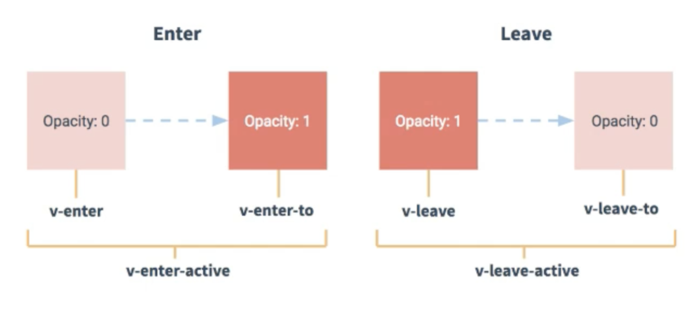

<!-- START doctoc generated TOC please keep comment here to allow auto update -->
<!-- DON'T EDIT THIS SECTION, INSTEAD RE-RUN doctoc TO UPDATE -->
**Table of Contents**  *generated with [DocToc](https://github.com/thlorenz/doctoc)*

- [笔记](#%E7%AC%94%E8%AE%B0)
  - [脚手架文件结构分析](#%E8%84%9A%E6%89%8B%E6%9E%B6%E6%96%87%E4%BB%B6%E7%BB%93%E6%9E%84%E5%88%86%E6%9E%90)
  - [不同版本的vue说明](#%E4%B8%8D%E5%90%8C%E7%89%88%E6%9C%AC%E7%9A%84vue%E8%AF%B4%E6%98%8E)
  - [vue.config.js配置文件](#vueconfigjs%E9%85%8D%E7%BD%AE%E6%96%87%E4%BB%B6)
  - [ref属性](#ref%E5%B1%9E%E6%80%A7)
  - [配置项props](#%E9%85%8D%E7%BD%AE%E9%A1%B9props)
  - [mixin（混入）配置](#mixin%E6%B7%B7%E5%85%A5%E9%85%8D%E7%BD%AE)
  - [插件](#%E6%8F%92%E4%BB%B6)
  - [scoped 样式](#scoped-%E6%A0%B7%E5%BC%8F)
  - [todo案例总结](#todo%E6%A1%88%E4%BE%8B%E6%80%BB%E7%BB%93)
  - [webStorage 浏览器的本地存储](#webstorage-%E6%B5%8F%E8%A7%88%E5%99%A8%E7%9A%84%E6%9C%AC%E5%9C%B0%E5%AD%98%E5%82%A8)
  - [组件自定义事件](#%E7%BB%84%E4%BB%B6%E8%87%AA%E5%AE%9A%E4%B9%89%E4%BA%8B%E4%BB%B6)
  - [全局事件总线（GlobaEventBus）](#%E5%85%A8%E5%B1%80%E4%BA%8B%E4%BB%B6%E6%80%BB%E7%BA%BFglobaeventbus)
  - [消息订阅与发布 （pubsub）](#%E6%B6%88%E6%81%AF%E8%AE%A2%E9%98%85%E4%B8%8E%E5%8F%91%E5%B8%83-pubsub)
  - [nextTick](#nexttick)
  - [Vue封装的过度与动画](#vue%E5%B0%81%E8%A3%85%E7%9A%84%E8%BF%87%E5%BA%A6%E4%B8%8E%E5%8A%A8%E7%94%BB)

<!-- END doctoc generated TOC please keep comment here to allow auto update -->

# 笔记

## 脚手架文件结构分析
```
├── node_modules
├── public 
│   ├── favicon.ico : 页面标签
│   └── index.html : 主页面
├── src
│   ├── App.vue : 汇总所有组件
│   ├── assets : 存放静态资源
│   │   └── logo.png
│   ├── components : 存放所有组件
│   │   └── HelloWorld.vue
│   └── main.js : 入口文件
├── .gitignore : git管理忽略的配置文件
├── babel.config.js : babel的配置文件
├── package-lock.json 包版本管理文件
├── package.json : 应用包配置文件
└── vue.config.js : 自定义脚手架配置文件 
```
## 不同版本的vue说明
- 1、vue.js 与 vue.runtime.xxx.js的区别:
      vue.js是完整版的vue，包括 核心功能+模板解析器
      vue.runtime.xxx.js 是vue精简版的，只包括了核心功能，没有模板解析器

- 2、因为vue.runtime.xxx.js是没有模板解析器的，所以不能使用template配置项，需要使用render接收到的createElement去指定具体内容

## vue.config.js配置文件
> 使用vue inspect > output.js可以查看vue脚手架的默认配置
> 使用vue.config.js可以对脚手架进行个性化的配置，详见：https://cli.vuejs.org/zh/config/


## ref属性
 1、被用来给元素或子组件注册引用信息（id替换者  
 2、应用在真是的html上获取的是DOM元素，应用在组件标签上获取的是子组件的实例对象（vc）  
 3、使用方式：
  ```
  <!-- 打标识 -->
  <h1 ref="xxx">....</h1>或者 <School ref="xxx"></School>
  <!-- 获取方式： -->
  this.$ref.xxx
  ```

## 配置项props
  功能：让组件接收外部传入的数据  
  1、传递数据

      <Demo name='xxx'>


  2、接收数据

    <!-- 第一种方式（只接收）： -->
    props: ['name']
    <!-- 第二种方式（限制类型） -->
    props: {
      name: String
    }
    <!-- 第三种接送方式（限制类型、限制必要性、制定默认值） -->
    props:{
      name: {
        type: String, //指令类型值
        required: true  //是否为必填项
      },
      age: {
        type: Number,  //指令类型值
        default: 80    //默认值
      },
      sex: {
        tyep: String,
        required: false
      }
    }
  
  备注： props是只读的，vue底层会对你的props进行监视，如果你进行了修改，就好提示警告，如业务需要进行修改，那么请复制一份props中的内容到data中，修改data中的数据


## mixin（混入）配置
  功能，可以把多个组件的共用项配置成一个混入对象
  使用方式：
  ```
    第一步定义混合：
      {
        data(){...},
        methods:{....}
      }
    第二步使用混合
      全局混入： Vue.mixin(xxx)
      局部混入：mixins:[xxx]
  ```

## 插件
  功能：用于增强vue
  本质：包含insert方法的一个对象，insert的第一个参数是vue，第二个参数是插件使用者传递的数据
  定义插件：
  ```
  对象.install = funtion(Vue, option){
    <!-- 添加全局过滤器 -->
    Vue.filter(...)
    <!-- 添加全局指令 -->
    Vue.directive(...)
    Vue.mixin(...)
    Vue.prototype.$MyMethod = funtion (...)
    Vue.prototype.$MyProto = funtion (...)
  }
  ```
  使用插件
  Vue.uer(...)


## scoped 样式
 作用：让样式局部生效，防止冲突

```
写法：<style scoped>
说明：<style lang="less" scoped> 其中lang是制定使用的less还是css，如果使用less，需要npm i less-loader
```

## todo案例总结
1、组件化编码流程  
  拆分静态组件：组件要按照功能点进行拆分，命名不要与html冲突  
  实现动态组件：考虑好数据存放的位置，数据是一个组件在用还是多个组件在用  
    一个组件在用：放在组件自身即可  
    多个组件在用：放在他们共同的父组件身上（状态提升）  
  实现交互，绑定事件开始

2、props适用于：     
  父组件 ==> 子组件 通信  
  子组件 ==> 父组件 通信 （要求父亲先给一个函数）  
  
3、使用v-model要切记：v-model绑定的值不能是props中的值，因为props是不可被修改的  

4、props传过来的值是对象的值，修改对象内的值Vue时不报错的，但是不推荐这样做  

## webStorage 浏览器的本地存储
1、存储内容一般为5M大小  
2、浏览器可以通过Window.localStorage和Widow.sessionStorage来试下浏览器本地存储机制  
3、相关API：  
```
  xxxStorage.setItem("xxx", 'xxx')
    接收一个键值对，会把键值对添加到本地存储中，如果键值存在，则更新对应的值

  xxxStorage.getItem("xxx")
    接收一个键值名，如果键值存在，返回对应的键值，如果不存在，则返回null

  xxxStorage.removeItem("xxx")
    接收一个键值名,并把键值从本地删除
  
  xxxStorage.clear()
    删除所有的本地存储
```

4、备注：
  sessionStorage方法会随着浏览器的关闭消失  
  localStorage需要手动删除才会消失  
  xxxStorage.getItem('xxx')：如果xxx对应的value的值获取不到，则返回null    
  Json.parse(null)的返回值还是null  

## 组件自定义事件
1、一种组件中的通信方式适用于 子====>父  

2、使用场景，父组件A，子组件B，B想给A传递数据，那么就要在A中给B绑定自定义事件（事件的回调在A中）  

3、绑定自定义事件：  
  第一种方式：在父组件中```<Demo @atguigu='test'/>或者<Demo v-on:atguigu='test'/>```
  第二种方式：
  ```
  <Demo ref='student'/>
  ...
  method(){
    this.$refs.xxx.$on('atguigu',this.test)
  }
  ```

  若想让事件使用一次，可以使用once或者$once方法      
 
4、触发自定义绑定事件```this.$emit('demo', this.name)```

5、解绑自定义事件```this.$off('atguigu')```

6、组件上也可以绑定原始的DOM事件、需要使用```native```来进行修饰

7、注意：通过```this.$refs.xxx.$on('atguigu',回调函数)```绑定自定义事件时，要买需要配置在methods中，要么使用箭头函数，否则this指向会出现问题


## 全局事件总线（GlobaEventBus）

1、一种组件间的通讯方式，适用于任何组价通信

2、安装全局事件总线
```
new Vue({
    render: h => h(App),
    beforeCreate() {
        Vue.prototype.$bus = this  //安装全局总线 $bus就是vm
    },
}).$mount("#app")
```
* 3、使用事件总线  
  接收数据，A组件想接收数据，则在A组件中给$bus绑定自定义事件，事件的回调留在A组件自身  
  ```
  methods(){
    demo(data){
      ....
    }
  }
  mounted(){
    this.$bus.$on('xxx', this.demo)
  }
  ```
  提供数据```this.$bus.$emit('xxx', 数据)```

&emsp;&emsp;4、最好在组件销毁前用$off解绑当前组件用到的自定义事件

## 消息订阅与发布 （pubsub）

* 一种组件间的通讯方式，适用于任何组价通信
  
* 使用步骤  
    1、安装pubsub命令 ```npm i pubsub-js ```

    2、导入： ```import pubsub from ’pubsub-js‘ ```

    3、接收数据：A组件想要接收数据，则在A组件中定义消息，订阅的回调函数在A组件中

      
      method(){
        demo(data){...}
      }
      ......
      mounted(){
        pubsub.subscribe('xxx', this.demo)
      }

    4、提供数据: ```pubsub.publish('xxx', 数据)```

    5、最好在beforeDestroy中使用pubsub.unsubscribe中<span style='color: read'>取消订阅</span>
    
## nextTick
* 语法：```this.$nextTick(回调函数）```
  
* 作用：在下一次DOM更新结束后执行调用函数
  
* 什么时候用：当改变数据后，要基于更新后的DOM的数据进行操作时，要在nextTick的回调函数中执行


## Vue封装的过度与动画
* 作用：在插入或者移除DOM元素时，在合适的时间给元素添加样式
  
* 图标
  

* 写法
  
    1、准备好样式  
    * 元素进入的样式
      * v-enter 进入起点
      * v-enter-active 进入过程
      * v-enter-to 进入的终点
    * 元素离开的样式
      * v-leave 离开的起点
      * v-leave-active 离开的过程中
      * v-leave-to 离开的终点  
  
  2、在使用```<transition>```包裹要过度的元素，并且要配置name属性
  ```
  <transition name='hello'>
    <h1 v-show='true'>你好啊</h1>
  </transition>
  ```

  3、如果使用多个元素，你那就要使用```transition-group>```每个元素都需要指定key值